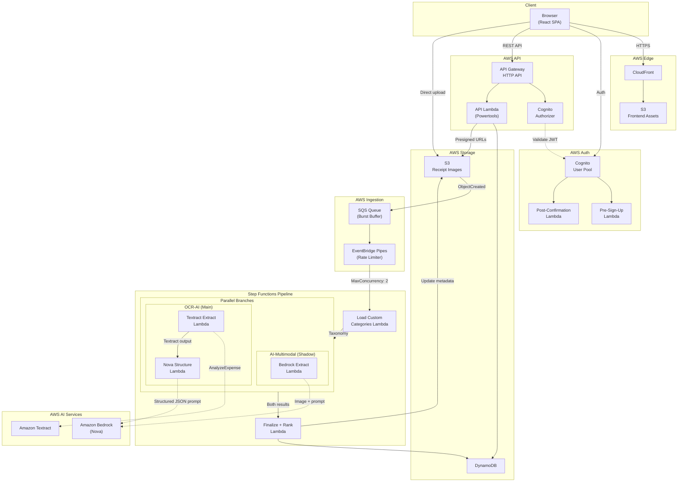
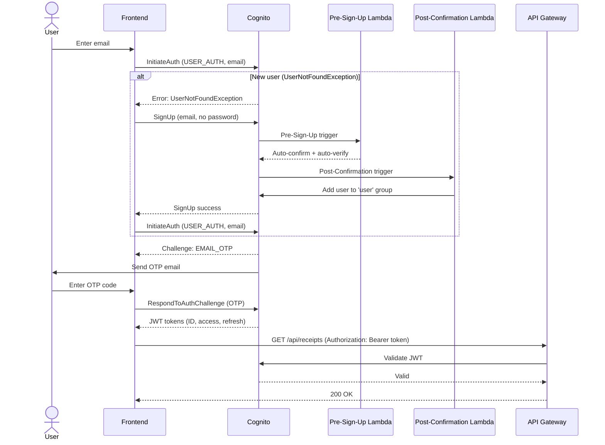
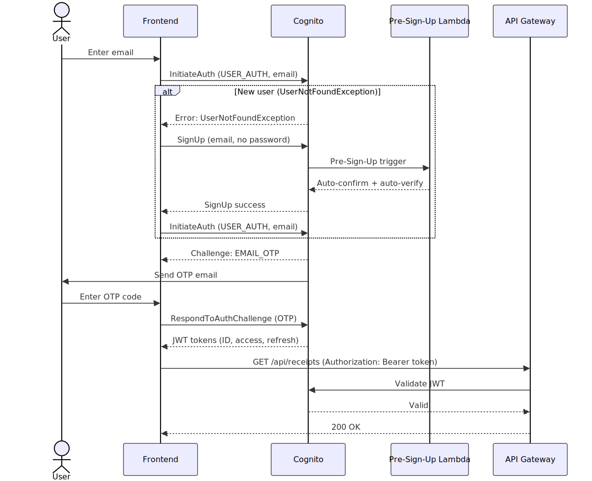
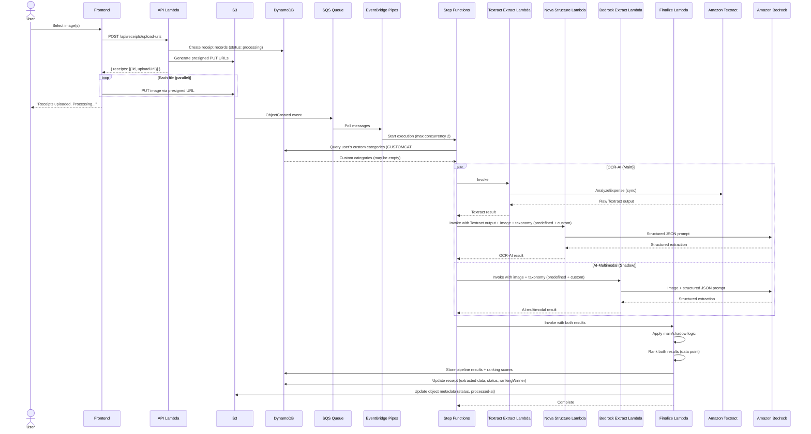
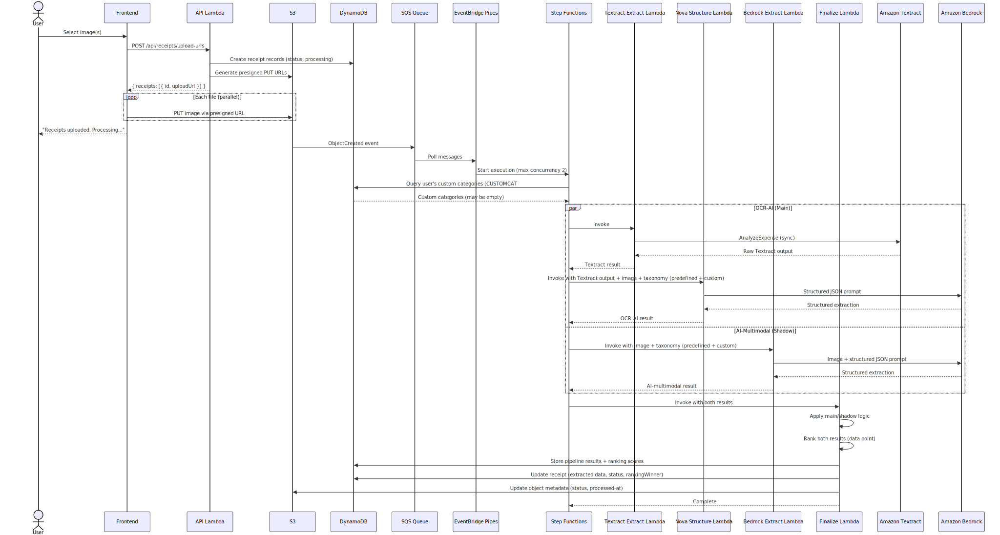

# NovaScan — Technical Specification

**Version:** 1.0
**Phase:** 2 — Specification & Architecture
**Date:** 2026-03-26
**Status:** RFC

---

## 1. Overview

NovaScan is a personal AI-powered receipt scanner and spending tracker. Users photograph or upload receipt images; the system extracts merchant, line items, and totals using dual OCR pipelines (OCR-AI: Textract + Nova, and AI-multimodal: Bedrock Nova); and presents spending data through a dashboard and transaction ledger.

- **Target users:** Personal use, ~100 users
- **Budget:** $25/month max for AWS services
- **Design system:** Lumina Ledger / "Digital Curator" — monochromatic grayscale, Manrope + Inter fonts

---

## 2. Milestones

### Milestone 1: Foundation & Authentication

Scaffold the project, deploy core infrastructure, and implement passwordless authentication.

**Capabilities delivered:**
- CDK infrastructure project with dev/prod stage support
- Cognito User Pool with email OTP (passwordless)
- API Gateway HTTP API with JWT authorizer
- Frontend project (Vite + React + Tailwind CSS v4 + shadcn/ui)
- CloudFront distribution serving frontend from S3
- Login page (enter email → enter OTP → authenticated)
- Protected route structure (redirect unauthenticated users to login)
- Empty dashboard shell with navigation (mobile bottom bar + desktop sidebar)

**Acceptance criteria:**
- `cdk deploy --context stage=dev` creates all resources without errors
- `cdk destroy --context stage=dev` tears down cleanly with no orphaned resources
- User can sign up and sign in with email OTP
- New users are auto-created on first sign-in (Pre-Sign-Up Lambda auto-confirms, Post-Confirmation Lambda assigns `user` Cognito group)
- Cognito User Pool has three groups: `user`, `staff`, `admin`
- Unauthenticated requests to API return 401
- Frontend loads at CloudFront default URL
- Navigation shows: Home, Scan, Analytics (placeholder), Transactions, Receipts

---

### Milestone 2: Receipt Upload & Storage

Enable users to upload receipt images via camera capture and file selection.

**Capabilities delivered:**
- S3 bucket for receipt image storage (private, SSE-S3 encryption)
- DynamoDB table (single-table design, on-demand billing)
- `POST /api/receipts/upload-urls` endpoint — generates presigned S3 PUT URLs and creates receipt records
- Upload UI: mobile camera capture, single file picker, bulk file selection (up to 10)
- Upload progress indicators per file
- Upload confirmation screen
- Receipt records created in DynamoDB with status `processing`
- Receipts page showing list of all receipts with status badges (processing/confirmed/failed)

**Acceptance criteria:**
- User can photograph a receipt via mobile browser camera (`<input capture="environment">`)
- User can select and upload up to 10 receipt images at once
- Uploads use presigned URLs — no file bytes pass through API Gateway
- Receipts appear in the Receipts list with "Processing" badge immediately after upload
- Images are stored in S3 at `receipts/{receiptId}.{ext}` (flat structure, ULID ensures uniqueness)
- Presigned URLs expire after 15 minutes (configurable via `presignedUrlExpirySec`)
- Files exceeding 10 MB or non-JPEG/PNG are rejected client-side
- Failed uploads are retried up to 3 times with exponential backoff (1s, 2s, 4s)
- If a presigned URL expires during retry, frontend requests a new URL for the failed file
- Upload summary shows per-file success/failure status with retry option for failed files

---

### Milestone 3: OCR Processing Pipeline

Automatically process uploaded receipts through both OCR pipeline paths.

**Capabilities delivered:**
- Decoupled ingestion: S3 `ObjectCreated` → SQS queue (burst buffer) → EventBridge Pipes (rate limiter, max concurrency 2) → Step Functions
- Step Functions state machine with parallel execution of both paths
- OCR-AI pipeline (main): Lambda invokes Textract `AnalyzeExpense` (sync) → Lambda sends Textract output to Bedrock Nova for structured JSON extraction
- AI-multimodal pipeline (shadow): Lambda sends receipt image to Bedrock Nova (multimodal) for direct structured JSON extraction
- Both pipeline results stored in DynamoDB as separate `PIPELINE#ocr-ai` and `PIPELINE#ai-multimodal` records
- Main pipeline result populates the receipt record. Shadow runs for comparison/data collection only.
- If main fails but shadow succeeds, shadow result is used with `usedFallback: true` flag
- Receipt status updated to `confirmed` or `failed`
- Error handling: Catch blocks within each parallel branch — each branch always completes (returns success or error payload). Parallel state never fails.
- Receipt extraction schema enforced on both pipeline outputs
- Pipeline comparison toggle: staff-role users can view both pipeline results side-by-side (UI only, no DB mutation)

**Acceptance criteria:**
- Uploading a receipt image to S3 triggers automatic processing via SQS → EventBridge Pipes → Step Functions
- EventBridge Pipes enforces max concurrency (configurable via `pipelineMaxConcurrency` in `cdk.json`) to stay under Textract 5 TPS limit
- Both pipelines execute in parallel for every receipt
- Main pipeline (default: OCR-AI) result populates the receipt. Shadow (default: AI-multimodal) stored for comparison only.
- If main fails but shadow succeeds, shadow result used with `usedFallback: true`
- Staff-role users can compare both pipeline results via UI toggle (UI only, no DB write)
- Receipt status transitions: `processing` → `confirmed` (or `failed`)
- Failed receipts include a `failureReason` attribute
- A receipt with a failed shadow pipeline but successful main pipeline is still marked `confirmed`

---

### Milestone 4: Receipt Management

Enable users to view, edit, and manage processed receipts.

**Capabilities delivered:**
- `GET /api/receipts/{id}` endpoint — receipt detail with line items
- `PUT /api/receipts/{id}` endpoint — update receipt fields
- `PUT /api/receipts/{id}/items` endpoint — bulk replace line items
- `DELETE /api/receipts/{id}` endpoint — hard delete (DynamoDB records + S3 image)
- `GET /api/categories` endpoint — predefined + user custom categories
- `POST /api/categories` endpoint — create custom category
- `DELETE /api/categories/{slug}` endpoint — delete custom category
- `GET /api/receipts/{id}/pipeline-results` endpoint — both pipeline outputs (staff role only)
- Receipt detail page: image alongside extracted data (responsive layout)
- Per-receipt pipeline comparison toggle (staff role only, UI-only — no DB mutation)
- Line item editing: inline edit name, quantity, price, subcategory; add/remove items
- Category picker: select from predefined taxonomy or custom categories
- Delete receipt with confirmation dialog
- Predefined category taxonomy loaded from constants

**Acceptance criteria:**
- User can view receipt image side-by-side with extracted data (desktop) or stacked (mobile)
- Staff-role users can toggle between OCR-AI and AI-multimodal results on each receipt (UI-only comparison, no DB write)
- Non-staff users do not see the pipeline toggle
- `GET /api/receipts/{id}/pipeline-results` returns 403 for non-staff users
- User can edit any line item field and save changes
- User can add new line items or remove existing ones
- User can change category and subcategory from the predefined taxonomy
- User can create a custom category and assign it to a receipt
- Custom category slugs are unique per user (not globally)
- No user can read, edit, or delete another user's receipts, line items, or custom categories
- User can delete a custom category (receipts keep the orphaned slug)
- Deleting a receipt removes the DynamoDB records AND the S3 image
- Pipeline results endpoint returns both OCR-AI and AI-multimodal extraction outputs with ranking scores and `rankingWinner`

---

### Milestone 5: Dashboard & Transactions

Provide spending overview and transaction browsing.

**Capabilities delivered:**
- `GET /api/dashboard/summary` endpoint — aggregated spending metrics (pandas in Lambda)
- `GET /api/transactions` endpoint — flattened receipt list with filtering and sorting
- Dashboard page: total spent this week and this month, % change vs prior period, receipt count, top categories (up to 5), recent activity (up to 5)
- Transactions page: sortable table (date, merchant, category, amount, status)
- Search by merchant name (partial match, case-insensitive)
- Filter by date range, category, status
- Analytics page: "Coming Soon" placeholder
- Mobile-optimized layouts for all pages

**Acceptance criteria:**
- Dashboard shows accurate week-to-date and month-to-date spending totals
- Dashboard shows percentage change compared to previous week and previous month
- Top categories are sorted by total descending
- Transactions table supports column sorting (date, amount, merchant)
- Date range filter narrows results correctly
- Category filter shows only receipts in the selected category
- Merchant search matches partial names (e.g., "whole" matches "Whole Foods Market")
- Analytics page displays a "Coming Soon" message with no broken UI
- All pages are usable on a 375px mobile viewport

---

### Milestone 6: Custom Domain & Production Polish

Deploy to production with custom domain and UX polish.

**Capabilities delivered:**
- ACM certificate for `subdomain.example.com` (us-east-1)
- CloudFront alternate domain name configuration
- Documentation for Cloudflare DNS CNAME setup (DNS-only mode)
- Production stage deployment (`cdk deploy --context stage=prod`)
- Error boundaries (React) — graceful fallback for component crashes
- Loading skeletons for async data
- Empty states for new users (no receipts, no transactions)
- 404 page for unknown routes
- Mobile responsiveness verification across all pages

**Acceptance criteria:**
- App accessible at `https://subdomain.example.com`
- HTTPS enforced (HTTP redirects to HTTPS)
- Production deployment is isolated from dev (separate stack, separate resources)
- All error scenarios display user-friendly messages (not raw error JSON)
- New user sees a welcoming empty state with a CTA to scan their first receipt
- `cdk destroy --context stage=prod` removes all production resources
- Monthly AWS cost at typical personal usage (<100 receipts/month) is under $25

---

## 3. System Architecture

### Architecture Pattern

Modular monolith on AWS serverless. A single API Lambda handles all REST endpoints via Lambda Powertools routing. OCR processing is a separate concern: S3 uploads feed into an SQS queue (burst buffer), EventBridge Pipes rate-limits ingestion (max concurrency 2), and Step Functions orchestrates dedicated pipeline Lambdas. Frontend is a static React SPA served from S3 via CloudFront.

**Why this is appropriate:**
- ~100 users — no scaling concerns requiring microservices
- Single developer — operational simplicity over distributed systems
- All AWS-native — no third-party infrastructure management
- Each functional area (API, pipeline, frontend, infra) is independently maintainable within the monorepo with clear boundaries

### Component Overview

| Component | Technology | Purpose |
|-----------|-----------|---------|
| **Frontend** | Vite + React + Tailwind CSS v4 + shadcn/ui | SPA served from S3/CloudFront |
| **API** | Lambda Powertools (Python) + Pydantic | Single Lambda, all REST routes |
| **Auth** | Amazon Cognito (email OTP) | Passwordless auth, JWT issuance |
| **Storage** | Amazon DynamoDB (on-demand) | All application data, single-table design |
| **Images** | Amazon S3 | Receipt image storage via presigned URLs |
| **Ingestion** | SQS + EventBridge Pipes | Burst buffer + rate limiter (max concurrency 2) |
| **OCR Pipeline** | Step Functions + Lambda | Orchestrates parallel Textract and Bedrock paths |
| **OCR — OCR-AI** | Textract AnalyzeExpense + Bedrock Nova | Primary extraction path |
| **OCR — AI-multimodal** | Bedrock Nova (multimodal) | Secondary extraction path (A/B comparison) |
| **CDN** | Amazon CloudFront | HTTPS, caching, custom domain |
| **IaC** | AWS CDK (Python) | Infrastructure deployment and teardown |

### Auth Flow

Cognito passwordless email OTP. A single screen handles both registration and login:

1. User enters email
2. Frontend calls Cognito `InitiateAuth` (USER_AUTH flow, email as username)
3. If user exists → Cognito sends OTP challenge
4. If new user → `InitiateAuth` fails with `UserNotFoundException` → Frontend calls `SignUp` (passwordless, no password) → Pre-Sign-Up Lambda auto-confirms + auto-verifies email → Post-Confirmation Lambda adds user to `user` Cognito group → Frontend retries `InitiateAuth`
5. Cognito sends OTP to email
6. User enters OTP → frontend calls `RespondToAuthChallenge`
7. Cognito returns JWT tokens (ID, access, refresh). ID token includes `cognito:groups` claim (e.g., `["user"]`).
8. Frontend stores tokens in memory (access/ID) and localStorage (refresh)
9. All API calls include the ID token in `Authorization: Bearer {token}` header
10. API Gateway Cognito authorizer validates the JWT on every request
11. API Lambda extracts `userId` from `sub` claim and `roles` from `cognito:groups` claim

The frontend uses `@aws-sdk/client-cognito-identity-provider` directly — no Amplify dependency.

### Role-Based Access Control (RBAC)

Cognito User Pool Groups provide role-based access:

| Role | Cognito Group | Capabilities |
|------|--------------|-------------|
| `user` | `user` | Full CRUD on own receipts, categories. View own dashboard/transactions. |
| `staff` | `staff` | All `user` permissions + view pipeline comparison toggle + `GET /api/receipts/{id}/pipeline-results` |
| `admin` | `admin` | All `staff` permissions + manage user roles (via Cognito Console/CLI) |

**Enforcement:**
- **API Gateway:** Validates JWT, rejects anonymous requests (401)
- **API Lambda (data isolation):** All DynamoDB queries scoped to `PK = USER#{authenticated userId}`. No user can access another user's data.
- **API Lambda (role checks):** Role-gated endpoints check `cognito:groups` claim. Returns 403 if insufficient role.

**Default:** New users are assigned to the `user` group by the Post-Confirmation Lambda. Admin promotes users to `staff` or `admin` via `aws cognito-idp admin-add-user-to-group`.

### Role Management Best Practices

| Action | Method | Who |
|--------|--------|-----|
| New user → `user` group | Automatic (Post-Confirmation Lambda) | System |
| Promote to `staff` or `admin` | `aws cognito-idp admin-add-user-to-group` | Admin (CLI/Console) |
| Remove from group | `aws cognito-idp admin-remove-user-from-group` | Admin |
| List group members | `aws cognito-idp list-users-in-group` | Admin |

**Group precedence:** `admin=0`, `staff=1`, `user=2` (lower = higher priority). Relevant for Cognito identity pool federation if added later.

**Token lifecycle:** When an admin changes a user's role, existing JWTs still contain the old `cognito:groups` claim until they expire. Access token TTL defaults to 60 minutes. For immediate role changes, force sign-out via `aws cognito-idp admin-user-global-sign-out` — invalidates all tokens, user must re-authenticate.

**Audit trail:** CloudTrail automatically logs all `admin-add-user-to-group` and `admin-remove-user-from-group` calls with timestamp, caller identity, and parameters. No custom audit logging needed for MVP.

**No admin API endpoints for MVP.** Role management is via CLI/Console only. At ~100 users this is manageable. Post-MVP: add `POST /api/admin/users/{id}/roles` behind `admin` role check if in-app management is needed.

### Upload Flow

1. User selects image(s) in frontend (camera capture or file picker)
2. Frontend validates: JPEG/PNG only, max 10 MB per file, max 10 files per batch
3. Frontend calls `POST /api/receipts/upload-urls` with file metadata
4. API Lambda generates presigned S3 PUT URLs, creates receipt records in DynamoDB (status: `processing`)
5. Frontend uploads files directly to S3 via presigned URLs (parallel for bulk)
6. Frontend tracks per-file upload status. Failed uploads retry up to 3 times (exponential backoff: 1s, 2s, 4s). If presigned URL expired, frontend requests a new URL for just the failed file.
7. Frontend shows upload summary: "{N} of {M} receipts uploaded. Processing will take a moment." Failed files listed with retry option.
8. S3 `ObjectCreated` event → SQS queue → EventBridge Pipes (max concurrency configurable) → Step Functions

**S3 key format:** `receipts/{receiptId}.{ext}` — flat structure, ULID ensures uniqueness. No userId in path; the receiptId maps to the DynamoDB record which contains the userId.

**Orphaned records:** If a file never uploads (browser closed, all retries failed), the DynamoDB receipt stays in `processing` with no S3 object. Harmless at MVP scale — user can manually delete. Post-MVP: garbage-collect stale `processing` records older than 24 hours.

### Processing Flow

Decoupled ingestion ensures Textract rate limits are never hit:

1. **Buffer:** S3 `ObjectCreated` event pushes to SQS queue. SQS absorbs burst traffic from bulk uploads.
2. **Rate Limiter:** EventBridge Pipes consumes from SQS with `MaximumConcurrency` (configurable via `pipelineMaxConcurrency` in `cdk.json`, default: 2). At most N Step Functions executions run concurrently, staying well under Textract's 5 TPS limit.
3. **Parallel branch** (both execute for every receipt):
   - **Before branching**, Step Functions passes the user's custom categories to both pipeline Lambdas. The Finalize Lambda (or a lightweight pre-step) queries `PK = USER#{userId}, SK begins_with CUSTOMCAT#` and injects the custom category list into both branches' input payload. This adds ~5–10ms (single DynamoDB query, typically <1KB response). If the user has no custom categories, the query returns empty and the predefined taxonomy is used alone.
   - **Main pipeline** (default: OCR-AI): Lambda calls Textract `AnalyzeExpense` (synchronous, single page) → Lambda sends Textract output + image to Bedrock Nova with structured JSON prompt that includes both predefined taxonomy and user's custom categories
   - **Shadow pipeline** (default: AI-multimodal): Lambda sends image to Bedrock Nova (multimodal) with structured JSON prompt that includes both predefined taxonomy and user's custom categories
   - Each branch has a `Catch` block — returns either a success result or an error payload. The Parallel state never fails.
   - Which pipeline is main vs shadow is controlled by `defaultPipeline` in `cdk.json` (default: `ocr-ai`).
4. **Finalize:** Lambda applies main/shadow logic, then ranks:
   - **Main/shadow selection:**
     - If main succeeded → use main result to populate the receipt
     - If main failed but shadow succeeded → use shadow result, set `usedFallback: true`
     - If both failed → set status to `failed`
   - **Ranking (data collection only):** Runs `rank_results` on both pipeline outputs regardless of which was selected. Computes a composite `rankingScore` (0–1) for each based on: confidence, field completeness (fraction of non-null fields), line item count, and total consistency (do line items sum to subtotal/total?). Sets `rankingWinner` on the receipt to whichever pipeline scored higher. This does NOT affect which result is displayed — it's purely for studying pipeline performance over time.
   - Stores both pipeline results (with `rankingScore`) in DynamoDB regardless of outcome
   - Updates receipt record with extracted data (merchant, total, line items, category), sets status to `confirmed` or `failed`, sets `rankingWinner`
   - Updates S3 object metadata (`x-amz-meta-status`, `x-amz-meta-receipt-id`, `x-amz-meta-processed-at`) via `copy_object` with `MetadataDirective: REPLACE`

Both paths produce output conforming to the Receipt Extraction Schema (Section 7).

---

## 4. Architecture Diagrams

### System Architecture





### OCR Pipeline State Machine

```mermaid
stateDiagram-v2
    [*] --> LoadCustomCategories
    note right of LoadCustomCategories: Query user's CUSTOMCAT# entities

    LoadCustomCategories --> Parallel

    state Parallel {
        [*] --> Main_Pipeline
        [*] --> Shadow_Pipeline

        state Main_Pipeline {
            note right of Main_Pipeline: Default: OCR-AI
            [*] --> TextractExtract
            TextractExtract --> NovaStructure
            NovaStructure --> [*]
            TextractExtract --> Main_Failed: Catch
            NovaStructure --> Main_Failed: Catch
            Main_Failed --> [*]
        }

        state Shadow_Pipeline {
            note right of Shadow_Pipeline: Default: AI-multimodal
            [*] --> BedrockExtract
            BedrockExtract --> [*]
            BedrockExtract --> Shadow_Failed: Catch
            Shadow_Failed --> [*]
        }
    }

    state Finalize {
        note right of Finalize: Main/shadow selection + ranking
        [*] --> ApplyMainShadowLogic
        ApplyMainShadowLogic --> RankResults
        RankResults --> UpdateReceipt
        UpdateReceipt --> UpdateS3Metadata
        UpdateS3Metadata --> [*]
    }

    Parallel --> Finalize
    Finalize --> [*]
```



### Auth Sequence





### Upload & Processing Sequence





---

## 5. Database Schema

### DynamoDB Single-Table Design

**Table name:** `novascan-{stage}`
**Billing mode:** Pay-per-request (on-demand)
**Encryption:** AWS-owned key (default)
**Point-in-time recovery:** Enabled
**Deletion protection:** Enabled for prod, disabled for dev

#### Key Schema

| Entity | PK | SK | entityType |
|--------|----|----|------------|
| User Profile | `USER#{userId}` | `PROFILE` | `PROFILE` |
| Receipt | `USER#{userId}` | `RECEIPT#{ulid}` | `RECEIPT` |
| Line Item | `USER#{userId}` | `RECEIPT#{ulid}#ITEM#{nnn}` | `ITEM` |
| Pipeline Result | `USER#{userId}` | `RECEIPT#{ulid}#PIPELINE#{type}` | `PIPELINE` |
| Custom Category | `USER#{userId}` | `CUSTOMCAT#{slug}` | `CUSTOMCAT` |

- `{userId}` — Cognito `sub` (UUID)
- `{ulid}` — ULID, lexicographically sortable by creation time
- `{nnn}` — three-digit zero-padded line item sort order (001, 002, ..., 999)
- `{type}` — `ocr-ai` or `ai-multimodal`
- `{slug}` — URL-safe lowercase slug (e.g., `groceries-food`)
- `entityType` — discriminator attribute on all entities, used in filter expressions to avoid scanning non-target rows

#### Global Secondary Index: GSI1 (Receipts by Date)

A **sparse GSI** containing only receipt records, enabling efficient date-range queries without scanning line items or pipeline results.

| Attribute | Value | Set On |
|-----------|-------|--------|
| `GSI1PK` | `USER#{userId}` | RECEIPT entities only |
| `GSI1SK` | `{receiptDate}#{ulid}` | RECEIPT entities only |

- **Sparse:** Only RECEIPT entities have `GSI1PK`/`GSI1SK` attributes. Line items, pipeline results, profiles, and custom categories are excluded automatically.
- **Projection:** `ALL` (project all receipt attributes into GSI)
- **Sort:** GSI1SK sorts by `receiptDate` then by ULID within the same date (most recent first with reverse query)
- **Cost:** ~$0.01/month additional writes at MVP scale. Net read cost reduction vs full partition scans.

#### User Profile Attributes

> **Future use — not implemented in MVP.** The User Profile entity is reserved for storing user preferences (currency, display name, theme) post-MVP. For MVP, all user identity data (email, roles, userId) is read from the Cognito JWT. The user↔receipt and user↔custom-category relationships are established through the `PK = USER#{userId}` partition key pattern — no profile record required.

| Attribute | Type | Description |
|-----------|------|-------------|
| `email` | S | Email address |
| `displayName` | S | Display name (defaults to email prefix) |
| `createdAt` | S | ISO 8601 |
| `updatedAt` | S | ISO 8601 |

#### Receipt Attributes

| Attribute | Type | Required | Description |
|-----------|------|----------|-------------|
| `receiptDate` | S | No | Date on receipt (YYYY-MM-DD), from OCR |
| `merchant` | S | No | Merchant name, from OCR |
| `merchantAddress` | S | No | Merchant address |
| `total` | N | No | Total amount |
| `subtotal` | N | No | Subtotal before tax |
| `tax` | N | No | Tax amount |
| `tip` | N | No | Tip amount |
| `category` | S | No | Primary category slug |
| `subcategory` | S | No | Subcategory slug |
| `status` | S | Yes | `processing` / `confirmed` / `failed` |
| `imageKey` | S | Yes | S3 object key |
| `failureReason` | S | No | Error message if failed |
| `paymentMethod` | S | No | Payment method from receipt |
| `usedFallback` | BOOL | No | `true` if main pipeline failed and shadow result was used |
| `rankingWinner` | S | No | Which pipeline scored higher in ranking: `ocr-ai` or `ai-multimodal`. Informational only — does not affect display. |
| `createdAt` | S | Yes | ISO 8601 |
| `updatedAt` | S | Yes | ISO 8601 |

#### Line Item Attributes

| Attribute | Type | Description |
|-----------|------|-------------|
| `name` | S | Item name |
| `quantity` | N | Quantity (default 1) |
| `unitPrice` | N | Price per unit |
| `totalPrice` | N | Line total |
| `subcategory` | S | Subcategory slug (optional) — uses parent category's subcategory slugs |

#### Pipeline Result Attributes

| Attribute | Type | Description |
|-----------|------|-------------|
| `extractedData` | M | Full extraction output as DynamoDB map |
| `confidence` | N | Overall confidence (0.0–1.0) |
| `rankingScore` | N | Composite ranking score (0.0–1.0) computed by Finalize Lambda. Based on confidence, field completeness, line item count, and total consistency. For data collection only. |
| `processingTimeMs` | N | Processing duration in milliseconds |
| `modelId` | S | Bedrock model ID used |
| `createdAt` | S | ISO 8601 |

#### Custom Category Attributes

| Attribute | Type | Description |
|-----------|------|-------------|
| `displayName` | S | User-facing name |
| `parentCategory` | S | Parent predefined category slug (optional) |
| `createdAt` | S | ISO 8601 |

#### Access Patterns

| # | Pattern | Query |
|---|---------|-------|
| 1 | Get user profile _(future use — not MVP)_ | PK = `USER#{userId}`, SK = `PROFILE` |
| 2 | List all receipts | **GSI1:** `GSI1PK = USER#{userId}` (returns only receipts, sorted by date) |
| 2a | List receipts by date range | **GSI1:** `GSI1PK = USER#{userId}` AND `GSI1SK BETWEEN {startDate} AND {endDate}~` |
| 2b | List receipts by category/status | **GSI1:** query + FilterExpression on `category` / `status` |
| 3 | Get receipt with line items | PK = `USER#{userId}`, SK `begins_with` `RECEIPT#{ulid}` (returns receipt + items + pipeline results) |
| 4 | Get pipeline results only | PK = `USER#{userId}`, SK `begins_with` `RECEIPT#{ulid}#PIPELINE#` |
| 5 | List custom categories | PK = `USER#{userId}`, SK `begins_with` `CUSTOMCAT#` |
| 6 | Delete receipt + related | Query PK = `USER#{userId}`, SK `begins_with` `RECEIPT#{ulid}` → `BatchWriteItem` delete all |

**GSI1** provides efficient receipt listing and date-range queries. Category and status filtering uses FilterExpression on GSI1 results — now only scanning receipt records (no line items or pipeline results).

**Known query limitations (acceptable at MVP scale):**
- **Dashboard aggregation** queries the user's receipts via GSI1 and aggregates with pandas in Lambda. O(all receipts for the month) per request with date-range key condition. ~2s cold start from pandas dependency is acceptable at MVP scale (Lambda SnapStart available if needed). First candidate for pre-computed aggregates if performance degrades.
- **Category and status filtering** uses FilterExpression after GSI1 query. Reads all receipts in the date range, then filters. Efficient enough at MVP scale since GSI1 eliminates the 6x read amplification from line items and pipeline results.
- **Merchant search** is a full-scan with case-insensitive substring match in Lambda. Only viable option without OpenSearch. Fine for personal use.

---

## 6. API Contracts

See [api-contracts.md](api-contracts.md) for full endpoint specifications.

**Base path:** `/api`
**Auth:** All endpoints require `Authorization: Bearer {id_token}` (Cognito JWT)
**Content-Type:** `application/json`

| Method | Path | Description |
|--------|------|-------------|
| `POST` | `/api/receipts/upload-urls` | Generate presigned upload URLs |
| `GET` | `/api/receipts` | List receipts |
| `GET` | `/api/receipts/{id}` | Get receipt detail with line items |
| `PUT` | `/api/receipts/{id}` | Update receipt fields |
| `DELETE` | `/api/receipts/{id}` | Hard delete receipt |
| `PUT` | `/api/receipts/{id}/items` | Bulk replace line items |
| `GET` | `/api/transactions` | List transactions (flattened view) |
| `GET` | `/api/dashboard/summary` | Dashboard summary metrics |
| `GET` | `/api/categories` | List all categories |
| `POST` | `/api/categories` | Create custom category |
| `DELETE` | `/api/categories/{slug}` | Delete custom category |
| `GET` | `/api/receipts/{id}/pipeline-results` | Both pipeline results — **staff role only** |

---

## 7. Receipt Extraction Schema

The shared JSON contract that both OCR pipelines must produce. Used as the structured output format in Bedrock Nova prompts.

```json
{
  "merchant": {
    "name": "string",
    "address": "string | null",
    "phone": "string | null"
  },
  "receiptDate": "YYYY-MM-DD | null",
  "currency": "USD",
  "lineItems": [
    {
      "name": "string",
      "quantity": 1.0,
      "unitPrice": 0.00,
      "totalPrice": 0.00,
      "subcategory": "string | null"
    }
  ],
  "subtotal": 0.00,
  "tax": 0.00,
  "tip": "number | null",
  "total": 0.00,
  "category": "string (predefined category slug)",
  "subcategory": "string (predefined subcategory slug)",
  "paymentMethod": "string | null",
  "confidence": 0.00
}
```

**Field notes:**
- `receiptDate` — date printed on the receipt, not the upload date. Null if unreadable.
- `currency` — always `USD` for MVP. No multi-currency support.
- `lineItems[].subcategory` — subcategory slug for the line item. For grocery receipts, uses the product-type subcategories (Produce, Meat & Seafood, etc.). For non-grocery receipts, optional/null.
- `category` / `subcategory` (receipt-level) — AI assigns from the predefined taxonomy. Category is the top-level (e.g., `groceries-food`), subcategory is the store type (e.g., `supermarket-grocery`). Defaults to `other` / `uncategorized` when confidence is low.
- `confidence` — overall extraction confidence (0.0–1.0). Derived from Textract confidence scores (OCR-AI path) or model logprobs (AI-multimodal path).
- All monetary values are in decimal (e.g., `5.99`, not `599`).

---

## 8. Category Taxonomy

See [category-taxonomy.md](category-taxonomy.md) for the full predefined category and subcategory list.

**13 top-level categories** with subcategories. AI assigns from this taxonomy during extraction. Users can override and create custom categories.

**Grocery subcategories** serve dual purpose: receipt-level subcategory (store type) and line-item subcategory (product department). Slugs: Produce, Meat & Seafood, Breads & Bakery, Deli & Prepared Food, Dairy Cheese & Eggs, Frozen Food, Snacks, Pantry, Beverages.

**Custom categories:**
- User-scoped, stored in DynamoDB single table under the user's partition (`PK = USER#{userId}`, `SK = CUSTOMCAT#{slug}`)
- Can optionally specify a parent predefined category
- **UX entry point (MVP):** From the receipt detail page category picker → "Create Custom Category" option → modal with display name + optional parent → `POST /api/categories` → new category appears in picker. No standalone category management page for MVP.
- **Pipeline relationship:** Custom categories **are** included in the AI extraction prompt. Before the parallel pipeline branches execute, a pre-step queries the user's custom categories from DynamoDB (`PK = USER#{userId}, SK begins_with CUSTOMCAT#`) and appends them to the predefined taxonomy in the structured JSON prompt. This adds ~5–10ms latency (single DynamoDB query). The AI can assign custom categories directly during extraction — no manual reassignment required if the AI recognizes a match. If the user has no custom categories, only the predefined taxonomy is used.

---

## 9. Development Environment Setup

### Prerequisites

| Tool | Version | Purpose |
|------|---------|---------|
| Python | 3.13+ | Backend + CDK |
| Node.js | 22 LTS | Frontend |
| Docker | Latest | DynamoDB Local for unit tests |
| AWS CLI | v2 | AWS account access |
| uv | Latest | Python package management |
| AWS CDK CLI | Latest | `npm install -g aws-cdk` |

### Project Structure

```
novascan/
├── backend/                    # Python Lambda code
│   ├── pyproject.toml
│   ├── src/
│   │   └── novascan/
│   │       ├── __init__.py
│   │       ├── api/            # API Lambda handlers
│   │       │   ├── __init__.py
│   │       │   ├── app.py      # Powertools resolver + handler
│   │       │   ├── receipts.py
│   │       │   ├── transactions.py
│   │       │   ├── dashboard.py
│   │       │   ├── categories.py
│   │       │   └── upload.py
│   │       ├── pipeline/       # Pipeline Lambda handlers
│   │       │   ├── __init__.py
│   │       │   ├── textract_extract.py
│   │       │   ├── nova_structure.py
│   │       │   ├── bedrock_extract.py
│   │       │   └── finalize.py   # Main/shadow logic, S3 metadata update
│   │       ├── models/         # Pydantic models
│   │       │   ├── __init__.py
│   │       │   ├── receipt.py
│   │       │   ├── category.py
│   │       │   └── extraction.py
│   │       └── shared/         # Shared utilities
│   │           ├── __init__.py
│   │           ├── dynamo.py
│   │           └── constants.py
│   └── tests/
│       ├── conftest.py
│       ├── unit/
│       └── integration/
├── frontend/                   # React SPA
│   ├── package.json
│   ├── tsconfig.json
│   ├── vite.config.ts
│   ├── index.html
│   └── src/
│       ├── main.tsx
│       ├── App.tsx
│       ├── api/                # API client functions
│       ├── components/
│       │   └── ui/             # shadcn/ui components
│       ├── pages/
│       ├── hooks/
│       ├── lib/                # Utilities (cn, auth helpers)
│       └── types/
├── infra/                      # AWS CDK
│   ├── pyproject.toml
│   ├── cdk.json
│   ├── app.py
│   ├── stacks/
│   │   └── novascan_stack.py   # Main stack
│   └── constructs/
│       ├── __init__.py
│       ├── auth.py             # Cognito User Pool + Pre-Sign-Up + Post-Confirmation Lambdas
│       ├── api.py              # API Gateway + API Lambda
│       ├── storage.py          # S3 buckets + DynamoDB table
│       ├── pipeline.py         # SQS + EventBridge Pipes + Step Functions + pipeline Lambdas
│       └── frontend.py         # CloudFront + S3 frontend distribution
├── workflow/                   # Development workflow docs
├── CLAUDE.md
└── README.md
```

### Setup Commands

```bash
# Backend
cd backend && uv venv --python 3.13 && uv sync && cd ..

# Frontend
cd frontend && npm install && cd ..

# Infrastructure
cd infra && uv venv --python 3.13 && uv sync && cd ..

# DynamoDB Local (for unit tests)
docker run -d -p 8000:8000 amazon/dynamodb-local

# Deploy to dev
cd infra && uv run cdk deploy --context stage=dev

# Run backend tests
cd backend && uv run pytest

# Run frontend dev server
cd frontend && npm run dev
```

### Independent Deployment

Each component can be updated and deployed independently:

| Component | Deploy Method | Notes |
|-----------|--------------|-------|
| **Frontend** | `npm run build` → `aws s3 sync` → CloudFront invalidation | No CDK needed. Standalone script. |
| **API Lambda** | `cdk deploy` (detects code-only changes) or `aws lambda update-function-code` | Direct Lambda update is faster for tight iteration. |
| **Pipeline Lambdas** | Same as API Lambda | Each pipeline Lambda is a separate function. |
| **Infrastructure** | `cdk deploy` required | Adds/removes resources, IAM roles, etc. |

CDK detects which resources changed and only updates those. A code-only change to the API Lambda doesn't redeploy the pipeline or frontend. For the fastest iteration loop, use direct `aws lambda update-function-code` with a pre-built zip.

**Note:** CDK's `@aws-cdk/aws-lambda-python-alpha` has native `uv` support (GA). When a `uv.lock` file is detected, CDK uses `uv pip compile` for dependency resolution during Docker bundling.

### Configuration Management

All tunable settings are centralized in `cdk.json` under `context.config.{stage}`. CDK reads these at synth time and injects them as Lambda environment variables and construct properties.

```json
{
  "context": {
    "config": {
      "dev": {
        "pipelineMaxConcurrency": 2,
        "presignedUrlExpirySec": 900,
        "maxUploadFiles": 10,
        "maxUploadSizeMb": 10,
        "logLevel": "DEBUG",
        "defaultPipeline": "ocr-ai"
      },
      "prod": {
        "pipelineMaxConcurrency": 2,
        "presignedUrlExpirySec": 900,
        "maxUploadFiles": 10,
        "maxUploadSizeMb": 10,
        "logLevel": "INFO",
        "defaultPipeline": "ocr-ai"
      }
    }
  }
}
```

| Setting | Used By | Description |
|---------|---------|-------------|
| `pipelineMaxConcurrency` | EventBridge Pipes construct | Max concurrent Step Functions executions |
| `presignedUrlExpirySec` | API Lambda (upload) | Presigned URL expiration |
| `maxUploadFiles` | API Lambda (upload) + frontend | Max files per batch upload |
| `maxUploadSizeMb` | API Lambda (upload) + frontend | Max file size |
| `logLevel` | All Lambdas | Lambda Powertools log level |
| `defaultPipeline` | Finalize Lambda | Which pipeline is main vs shadow (`ocr-ai` or `ai-multimodal`) |

**To change a setting:** Edit `cdk.json` → `cdk deploy`. No code changes required.

### Runbook

See [runbook.md](runbook.md) for detailed instructions on local development, deployment (dev and prod), troubleshooting, and operational tasks.

### Key Dependencies

**Backend** (`backend/pyproject.toml`):
- `aws-lambda-powertools[all]` — routing, validation, logging, tracing
- `pydantic>=2.0` — data models and validation
- `boto3` — AWS SDK
- `python-ulid` — ULID generation for receipt IDs
- `pandas` — dashboard aggregation (groupby, sum, period comparisons)
- Dev: `pytest`, `pytest-cov`, `moto[dynamodb,s3,sqs,stepfunctions]`, `ruff`, `mypy`

**Frontend** (`frontend/package.json`):
- `react`, `react-dom` — UI framework
- `react-router-dom` — client-side routing
- `@tanstack/react-query` — server state management
- `@aws-sdk/client-cognito-identity-provider` — Cognito auth (AWS-native)
- `tailwindcss` — styling
- `class-variance-authority`, `clsx`, `tailwind-merge` — shadcn/ui utilities
- Dev: `vite`, `@vitejs/plugin-react`, `typescript`, `vitest`, `@testing-library/react`

**Infrastructure** (`infra/pyproject.toml`):
- `aws-cdk-lib>=2.170.0` — CDK core
- `constructs>=10.0.0` — CDK constructs

### Test Configuration

| Layer | Runner | Mocking | Scope |
|-------|--------|---------|-------|
| Backend unit | pytest | moto (DynamoDB, S3) | Models, handlers, utilities |
| Backend integration | pytest | DynamoDB Local (Docker) | End-to-end handler flows |
| Frontend unit | Vitest + React Testing Library | msw (API mocking) | Components, hooks |
| Infrastructure | pytest + CDK assertions | CDK snapshot tests | Stack structure verification |

---

## 10. Coding Standards

### Python (Backend + Infra)

- **Formatter/Linter:** ruff (format + lint, single tool)
- **Type checking:** mypy (strict mode)
- **Naming:** `snake_case` functions/variables, `PascalCase` classes, `UPPER_SNAKE` constants
- **Imports:** Absolute from `novascan` package (e.g., `from novascan.models.receipt import Receipt`)
- **Error handling:** Let Lambda Powertools handle unexpected errors (auto 500 + tracing). Catch only expected errors (validation, not-found) and return appropriate HTTP status codes.
- **Models:** All request/response bodies defined as Pydantic models. No raw `dict` manipulation for API data.
- **Logging:** Lambda Powertools `Logger` — structured JSON, automatic correlation IDs.

### TypeScript (Frontend)

- **Formatter/Linter:** ESLint + Prettier
- **Naming:** `camelCase` functions/variables, `PascalCase` components/types, `UPPER_SNAKE` constants
- **Components:** Functional components with hooks only. No class components.
- **State:** TanStack Query for server state, `useState`/`useReducer` for local UI state. No Redux/Zustand.
- **API calls:** Centralized in `src/api/`. One file per resource (e.g., `receipts.ts`, `auth.ts`).
- **Styling:** Tailwind utility classes. `cn()` helper for conditional classes. No CSS modules or styled-components.

### General

- Group files by feature/domain, not by type (exception: shared utilities).
- No premature abstraction. Three similar lines > one unnecessary helper.
- Test behavior, not implementation. No testing private methods.
- Git: conventional commits (`feat:`, `fix:`, `chore:`, `docs:`).
- No comments on obvious code. Comments only where logic is non-obvious.

---

## 11. Logging & Troubleshooting

### Structured Logging

All Lambda functions use Lambda Powertools `Logger` for structured JSON logging:
- **Correlation IDs:** Automatic `x-correlation-id` propagation across API calls. Step Functions execution ID for pipeline logs.
- **Cold start detection:** Logger automatically flags cold start invocations.
- **Log levels:** `DEBUG` in dev, `INFO` in prod. Configurable via `LOG_LEVEL` environment variable.
- **Sensitive data:** No PII (email, user IDs beyond Cognito sub) logged at INFO level. Debug-level may include request bodies.

### Distributed Tracing

Lambda Powertools `Tracer` wraps X-Ray:
- API Lambda: traces per route via `@tracer.capture_method` decorators
- Pipeline Lambdas: traces per Step Functions execution
- X-Ray service map shows: API Gateway → API Lambda → DynamoDB/S3, and SQS → Pipes → Step Functions → Pipeline Lambdas → Textract/Bedrock

### Custom Metrics

Lambda Powertools `Metrics` publishes to CloudWatch:
- `ReceiptUploaded` — count per upload batch
- `PipelineCompleted` — count per pipeline type (ocr-ai, ai-multimodal), with success/failure dimension
- `PipelineLatency` — processing time per pipeline type (milliseconds)
- `RankingDecision` — which pipeline the ranking algorithm scored higher (ocr-ai vs ai-multimodal), independent of main/shadow selection
- `RankingScoreDelta` — absolute difference between the two pipeline ranking scores (measures how close they are)
- `ReceiptStatus` — transitions (processing → confirmed, processing → failed)
- `UsedFallback` — count of receipts where main pipeline failed and shadow was used

### CloudWatch Resources

| Resource | Log Group Pattern |
|----------|------------------|
| API Lambda | `/aws/lambda/novascan-{stage}-api` |
| Textract Extract Lambda | `/aws/lambda/novascan-{stage}-textract-extract` |
| Nova Structure Lambda | `/aws/lambda/novascan-{stage}-nova-structure` |
| Bedrock Extract Lambda | `/aws/lambda/novascan-{stage}-bedrock-extract` |
| Finalize Lambda | `/aws/lambda/novascan-{stage}-finalize` |
| Step Functions | `/aws/states/novascan-{stage}-pipeline` |
| Pre-Sign-Up Lambda | `/aws/lambda/novascan-{stage}-pre-signup` |
| Post-Confirmation Lambda | `/aws/lambda/novascan-{stage}-post-confirmation` |
| Load Custom Categories Lambda | `/aws/lambda/novascan-{stage}-load-custom-categories` |

### Troubleshooting Receipt Processing

1. Check receipt status in DynamoDB (`status`, `failureReason`)
2. Check pipeline results in DynamoDB (`PIPELINE#ocr-ai`, `PIPELINE#ai-multimodal`) — which succeeded/failed?
3. Check Step Functions execution history (AWS Console → Step Functions → execution ID from SQS message)
4. Check CloudWatch logs for the specific Lambda that failed
5. Check SQS dead-letter queue for messages that failed delivery

**No custom dashboards for MVP.** Use CloudWatch defaults, Logs Insights ad-hoc queries, and Step Functions console for pipeline debugging.

---

## 12. Non-Functional Requirements

### Performance

| Metric | Target |
|--------|--------|
| API response (p95) | < 500ms |
| Receipt OCR processing | Best effort, no hard SLA (varies by receipt complexity and queue depth) |
| Frontend initial load (LCP) | < 3s |
| Dashboard freshness | Polling (configurable interval) |

### Cost

| Metric | Target |
|--------|--------|
| Monthly AWS bill | < $25 |
| Per-receipt processing | < $0.02 (both pipelines) |
| Baseline (zero traffic) | < $5/month |

### Security

- All data encrypted at rest (S3 SSE-S3, DynamoDB default encryption)
- All data in transit over HTTPS
- Presigned URLs expire after 15 minutes (configurable)
- JWT validated on every API request via Cognito authorizer
- S3 receipt bucket: private, no public access, `BlockPublicAccess` enabled
- IAM least-privilege for all Lambda execution roles
- No secrets in code — environment variables injected by CDK
- CORS restricted to the CloudFront domain
- **No anonymous access.** Every API endpoint requires a valid JWT.
- **Data isolation.** Every DynamoDB query is scoped to `PK = USER#{authenticated userId}`. No user can access another user's data.
- **Role-based access control (RBAC).** Cognito User Pool Groups (`user`, `staff`, `admin`) with `cognito:groups` claim in JWT. Role-gated endpoints return 403 for insufficient permissions. See Section 3 (RBAC) for details.
- **New users default to `user` role.** Post-Confirmation Lambda assigns the `user` group. Admin promotes via Cognito Console/CLI.

### Accessibility

- WCAG 2.1 AA for core flows (login, upload, receipt review)
- Keyboard navigable
- Semantic HTML with ARIA labels on interactive elements
- Color contrast meets AA ratio (grayscale palette naturally supports this)

### Reliability

- CloudFront serves cached frontend if S3 origin is unavailable
- Step Functions retries failed pipeline steps (max 2 retries, exponential backoff)
- DynamoDB point-in-time recovery enabled
- S3 versioning on receipt bucket

---

## 13. Deployment Architecture

### Environments

| Env | Purpose | Frontend Domain | API Domain |
|-----|---------|----------------|------------|
| dev | Development | CloudFront default URL | API Gateway default URL |
| prod | Production | `subdomain.example.com` | API Gateway default URL |

Both environments in the same AWS account with stage-prefixed resource names.

### Resource Naming Convention

`novascan-{stage}-{resource}` — e.g., `novascan-dev-receipts-bucket`, `novascan-prod-table`

### CORS Configuration

API Gateway HTTP API CORS settings:
- **Allowed origins:** CloudFront domain (dev: default URL, prod: `https://subdomain.example.com`)
- **Allowed methods:** GET, POST, PUT, DELETE, OPTIONS
- **Allowed headers:** Authorization, Content-Type
- **Max age:** 86400 (24 hours)

### Frontend Build & Deploy

Vite builds the React app to static files. Environment-specific values injected via `import.meta.env`:

| Variable | Description | Example |
|----------|-------------|---------|
| `VITE_API_URL` | API Gateway URL | `https://{id}.execute-api.us-east-1.amazonaws.com` |
| `VITE_COGNITO_USER_POOL_ID` | Cognito User Pool ID | `us-east-1_AbCdEf` |
| `VITE_COGNITO_CLIENT_ID` | Cognito App Client ID | `1234abcd...` |
| `VITE_AWS_REGION` | AWS region | `us-east-1` |

Values are sourced from CDK stack outputs at build time.

### Manual Deployment Steps (MVP — no CI/CD)

```bash
# 1. Deploy infrastructure (includes Lambda code bundling)
cd infra && uv run cdk deploy --context stage={stage}

# 2. Build frontend with stack outputs
cd frontend && VITE_API_URL=... VITE_COGNITO_USER_POOL_ID=... npm run build

# 3. Upload frontend to S3
aws s3 sync dist/ s3://novascan-{stage}-frontend/ --delete

# 4. Invalidate CloudFront cache
aws cloudfront create-invalidation --distribution-id {id} --paths "/*"
```

### Custom Domain Setup (prod only)

1. CDK creates ACM certificate for `subdomain.example.com` in us-east-1
2. ACM certificate validation: CDK outputs a CNAME name/value pair → add it in Cloudflare DNS
3. CDK creates CloudFront distribution with `subdomain.example.com` as alternate domain name
4. Add CNAME in Cloudflare DNS: `novascan` → `{distribution}.cloudfront.net`
5. **Cloudflare proxy must be OFF (DNS-only / gray cloud).** Cloudflare's proxy conflicts with CloudFront.

### CloudFront SPA Routing

CloudFront custom error response: 403/404 from S3 → return `/index.html` with HTTP 200. This enables React Router's client-side routing.

---

## 14. Negative Requirements

### What NovaScan is NOT

- **Not a multi-user platform.** No teams, shared ledgers, or cross-user data sharing. (Basic RBAC via Cognito Groups is included for staff/admin pipeline features.)
- **Not an expense reporting tool.** No approval workflows or accounting integrations.
- **Not a cash-back/rewards app.** No brand partnerships, offers, or gamification.
- **Not a real-time system.** Receipt processing is async. Dashboard updates on poll/refresh.
- **Not offline-capable.** Requires internet for all operations.
- **Not a native mobile app.** Responsive web only.

### Out of Scope for MVP

- Spending analytics charts and trends (placeholder only)
- AI chatbot / voice interface / RAG pipeline
- Budget tracking
- eReceipt email integration
- Multi-page receipt stitching
- Fraud/duplicate detection
- Horizontal scaling / multi-region
- Audit logging
- Multi-currency support
- HEIC image format (browser handles conversion for camera capture)
- Monitoring/alerting dashboards (use CloudWatch defaults)

### Future Considerations (Post-MVP)

These are acknowledged as desired features but are not in any MVP milestone:

- **CSV export** — export receipt data for spreadsheets or tax prep
- **CI/CD pipeline** — automated build, test, and deploy (GitHub Actions or CodePipeline)

### Design Constraints

- No server-side rendering — frontend is a static SPA
- No always-on compute — everything is serverless, scale-to-zero
- No third-party SaaS beyond AWS
- No GraphQL — REST API only
- No WebSocket — polling for status updates
